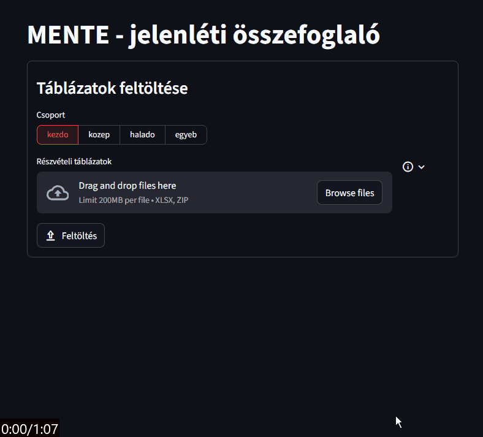

# MENTE - Jelenléti összesítés készítő – felhasználói útmutató

Ez a program Excel-fájlokból **összesített jelenléti riportot** készít.  
Tipikusan olyan Google Forms / Excel exportokat dolgoz fel, amelyek fájlneve például ilyen:

- `Középhaladós próba - 2024. 09. 09. (válaszok).xlsx`
- `Kezdős próba - 2022. 05. 09. (válaszok).xlsx`

A program:

- több Excel-fájlt feldolgoz egyszerre,
- egységesíti a neveket és e-mail címeket,
- egy **összefoglaló Excel táblázatot** hoz létre.

---

## Szükséges eszközök (egyszer kell megcsinálni)

Python-t **NEM szükséges külön telepíteni**

A program az **uv** nevű eszközt használja, ami automatikusan letölti a szükséges Python verziót, és kezeli a függőségeket.

---

### UV telepítése

#### Windows

1. Menj ide: [https://docs.astral.sh/uv/getting-started/installation/](https://docs.astral.sh/uv/getting-started/installation/)
2. Kövesd a telepítési útmutatást:

   - letöltheted a **Windows installer**-t, majd "Next Next Finish" módszer
   - vagy megnyithatsz egy powershell-t, és egy parancs futtatásával telepítheted a `uv`-t:

   ```powershell
       powershell -ExecutionPolicy ByPass -c "irm https://astral.sh/uv/install.ps1 | iex"
   ```

**Telepítés ellenőrzése:**

- Nyiss egy **Command Prompt**-ot (cmd)
- Írd be:

  ```bat
  uv --version
  ```

  Valami ilyesmi választ jelzi, hogy sikerült a telepítés: `uv 0.9.15 (5eafae332 2025-12-02)`

### Bemeneti fájlok

Hozz létre egy mappát, pl.: `D:/jelenleti_adatok/2024_25_osz/`
Ide töltsd le/csomagold ki a jelenléti ív fájljait. A webes felület elfogadja a tömörített (zip) állományt,
amit kapunk, ha Google Drive-ról töltjük le a táblázatokat.

**Fontos a fájlnév!**
A program a fájlnévből dátumot keres, pontokkal elválasztva.
_Ezt a (reguláris kifejezést) mintát, ami az `src/jelenlet/process.py` fájl 24. során lehet átírni, ha ez szükséges (pl. másfajta fájlnevek vannak)._

`XLSX_FILENAME_DATA_CUSTOM_PATTERN = r".*(\d{4})\. ?(\d{1,2})\. ?(\d{1,2})\..*\.xlsx"`

Az elkészült összesítő fájl neve a csoport kapcsoló értékeit (`kezdo, kozep, halado, egyeb`), az első és utolsó próba dátumát, illetve az összesítés létrehozásának idejét tartalmazza. Pl.: `kozep_proba_osszegzes_2025_09_08-2025_12_15_[2025_12_30__17_48].xlsx`

---

### A program futtatása

#### Webes felület elindítása

A programhoz van webes felület, ez excel fájlokon túl tömörített `.zip` fájlokat is képes fogadni.

Parancssor megnyitása után menjünk a projekt mappába, ahová letöltöttük ezt a projektet: `cd D:/mente_jelenleti`

Futtatása: `uv run jelenlet-web` paranccsal. Ezután megnyílk egy böngésző oldal a `localhost:8555` címen.

#### Webes felület használata

A használatát az alábbi videó demonstrálja:



#### Parancssoros felület használata

Parancssor megnyitása után menjünk a projekt mappába, ahová letöltöttük ezt a projektet.

```bat
cd D:/mente_jelenleti
```

Majd futtassuk:

```bat
uv run python -m jelenlet.cli --help
```

vagy:

```bat
uv run jelenlet --help
```

Ami, jó esetben kiírja az alábbi "help" szöveget:

```sh
$ uv run jelenlet --help
usage: jelenlet [-h] [--out OUT] [--szint {kezdo,kozep,halado,egyeb}] [--delete-db] [--clean] folder

Jelenléti adatok feldolgozása és Excel export készítés

positional arguments:
  folder                Bemeneti mappa elérési útja. Pl.: 'D:/workspaces/jupyter_notebooks/kozephalados_jelenleti/data/2025_26_osz'

options:
  -h, --help            show this help message and exit
  --out OUT             Kimeneti mappa az összefoglaló Excel fájlhoz (alapértelmezett: ./reports)
  --szint {kezdo,kozep,halado,egyeb}
                        Csoport szintje: kezdo | kozep | halado | egyeb (alapértelmezett: kozep)
  --delete-db           Futás elején kitörli az email-név adatbázist.
  --clean               Futás elején eltávolítja a kommenteket az adatbázisból.
```

Ez alapján már lehet is futtatni:

```sh
uv run jelenlet D:/jelenleti_adatok/2024_25_osz/ --csoport kezdo --out my_reports
```

Itt figyelni kell a program kimenetet. A program megpróbálja megkeresni a nevekben a hibákat.
Aki elrontotta egy-két kitöltésnél a sorrendjét, ékezeteket, stb, azt megpróbálja kitalálni, melyik lehet a helyes.
Ha van jó javaslata, arra a névre ilyesmit fog kiírni:

```text
Attempting to fix names: ['Dávid Faragó', 'Farago David', 'Faragó Dávid', 'Faragó David']
        Resolving with: ['Faragó Dávid'] reason:[only one last christian name detected]
        If incorrect, add either of following lines to EMAIL_NAME_DATABASE:
                dfarago193@gmail.com = Dávid Faragó
                dfarago193@gmail.com = Farago David
                dfarago193@gmail.com = Faragó Dávid
                dfarago193@gmail.com = Faragó David
```

Itt azt mondja, hogy a sok lehetőség közül a 'Faragó Dávid' nevet fogja használni minden `dfarago193@gmail.com` email címhez.
Ha ezzel nem értünk egyet, vagy felül akarjuk írni a döntését, az `data/database.ini` fájlt kell szerkeszteni.
Ez a fájl első futás után létrejön.

Figyeljük a program kimenetét, lesznek még olyan sorok is, amelyek így néznek ki:

```sh
Attempting to fix names: ['Cápa Krisztina', 'Cápa Kriszti']
ACTION REQUIRED: Could not autofix names: ['Cápa Krisztina', 'Cápa Kriszti']
        Add either of following lines to EMAIL_NAME_DATABASE dictionary:
                capakrisz12345@gmail.com = Cápa Krisztina
                capakrisz12345@gmail.com = Cápa Kriszti
```

Itt ki is írja, hogy "ACTION REQUIRED" - ugyanúgy fel kell vennünk a megfelelő sort a `database.ini` megfelelő sorába.
Ezt a program segíti, úgy, hogy kommentként beleírja ebbe a fájlba, nekünk csak döntenünk kell, melyiket választjuk.
Amelyiket jónak találjuk, **"kikommenteljük"**, azaz eltávolítjuk a sor elejéről a `#` karaktert.

Ha nincs egy név mellett az "ACTION REQUIRED", akkor automatikusan döntést hozott a helyes névről, ebben az esetben nem ír be kommentelt sorokat.

Ha minden nevet felvettünk, akkor futtassuk újra a programot (felfelé nyíllal elérhetjük az előző parancsokat).
Ha minden nevet kijavítottunk, akkor a program az emailcímek elírását próbálja kezelni.

Ha egy névhez több email cím tartozik, akkor felteszi a kérdést, melyik a helyes?
Előfordulhat az, hogy két azonos nevű ember szerepel, és különbözik az email címük. Ebben az esetben ugyanúgy vegyük fel őket a `database.ini`-be
Ha valaki elírta az email címét, akkor csak a helyeset vegyük fel.

Erre egy példa kimenet:

```sh
-------
Problem found:'Somi Rebeka' has multiple email addresses: ['somogybeka51@gmail.com', 'somibeka155@gmai.com']
        Add either of following lines to EMAIL_NAME_DATABASE:
                sombeka51@gmail.com = Somi Rebeka
                somibeka155@gmail.com = Somi Rebeka
```

Ebben az esetben a program a `database.ini` fájlba felvesz kikommentelt sorokat, lásd lentebb. Nekünk a jó sort vagy sorokat (különböző, azonos nevű emberek esetén) kell kikommentelni.

```ini
# Uncomment (at least) one of these lines:
# sombeka51@gmail.com = Somi Rebeka
# somibeka155@gmail.com = Somi Rebeka
```

Ha mindezzel megvagyunk, akkor a programot újból futtatva most már elkészíti az összefoglaló táblázatot:

A program kimenetének az alja:

```text
Saving report to my_reports\kozephalado_proba_osszegzes_2024_25_osz.xlsx
Done. Bye! :)
```

### Fejlesztőknek

Tesztek futtatása: `uv run pytest -v`

- verbose: `-v`
- don't suppress print: `-s`

Nyilvánossá tétel authentikációval:

```sh
ngrok http 8555 --url <ngrook dev url> --oauth=google --oauth-allow-email=<user_1>@gmail.com --oauth-allow-email=<user_2>@gmail.com
```
